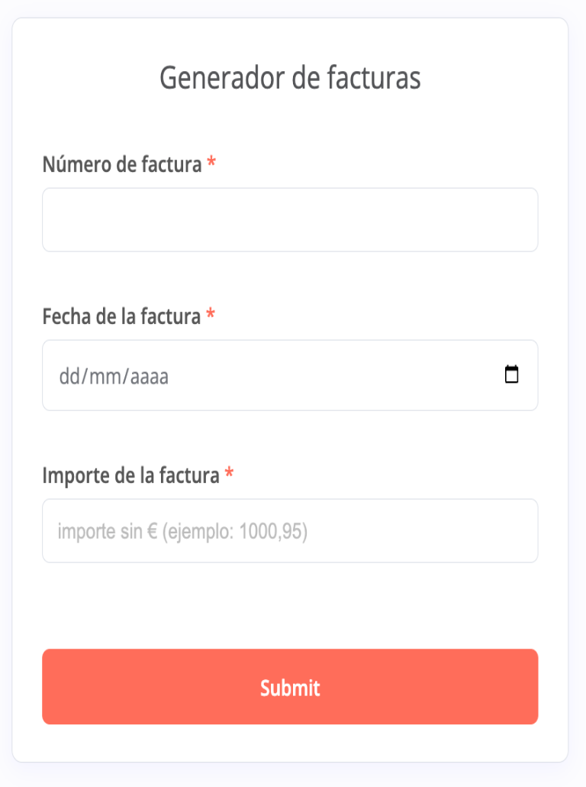

# Invoice Automator: No-Code Billing Solution for Small Business 💼

This project showcases an automated billing pipeline designed for non-technical users. It transforms a simple form entry into a professional PDF invoice, managing the entire document lifecycle from creation to delivery and archiving.

## ⚙️ Key Technical Features

* **User-Friendly Frontend:** Utilizes **n8n Forms** to provide a clean interface for data entry (Invoice #, Date, Amount), removing the need for the end-user to interact with spreadsheets directly.
* **Dynamic Template Engine:** Uses **Google Sheets** as a dynamic template engine. The workflow performs precise cell updates (VLOOKUP-style logic via n8n) to populate the invoice body.
* **Automated PDF Rendering:** Leverages Google Drive's internal conversion engine to transform structured spreadsheet data into a finalized, read-only PDF format.
* **Cloud Archiving & Delivery:** * **Google Drive:** Automatically organizes and uploads the PDF to a specific fiscal year folder.
    * **Gmail:** Executes immediate delivery to pre-defined recipients with the PDF attached.
* **Date Intelligence:** Includes a **JavaScript Code Node** to parse dates and translate month names into Spanish for professional formatting (e.g., "Servicios de Enero").

## 🛠️ Tech Stack
* **Orchestrator:** n8n.
* **Data & Templates:** Google Sheets.
* **Cloud Storage:** Google Drive API.
* **Communication:** Gmail API.
* **Logic:** JavaScript (Date parsing & string manipulation).

## 📊 Visual Workflow
The pipeline follows a linear, fail-safe path: Data Input -> Template Update -> PDF Conversion -> Storage -> Dispatch.

### 🖥️ User Interface (Frontend)
The system provides a simplified data entry form, ensuring that non-technical users can generate complex documents without touching a single spreadsheet cell.

## 🚀 Practical Utility
This tool reduced the manual invoicing time for a small service provider from **15 minutes per invoice to 10 seconds**, eliminating manual errors in PDF export and email attachments.

---
*Note: This is a prime example of high-impact, low-friction automation for traditional businesses looking to digitalize their operations.*
